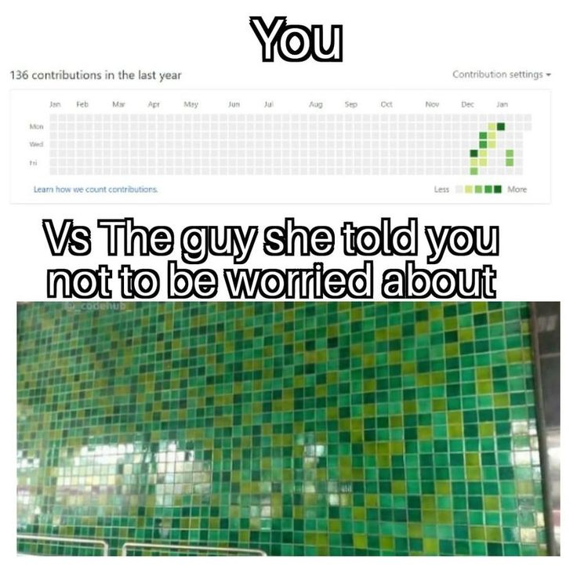

# HTTP-5114-0NA

Workshops in Web Dev 1

### Adam Thomas

[Professor Email](mailto:adam.thomas@humber.ca)

### Gaurav (Gary) Bhanot

[Professor Email](mailto:gaurav.bhanot@humber.ca)

**Friday**  
2:20p-6:00p   
NO J-110

> [!Important]
> Continue completing weekly tasks on time.

## Weekly To-Do

**Week 1**
- [x] Make Accounts (Discord, Stack Overflow, GitHub, BrickMMO Flow) & Complete to Assignment Outline
- [x] Post Accounts on Discussion Board SUBMITTED
- [x] Academic Integrity Assignment SUBMITTED

**Week 2**
- [x] Task "GitHub for Individuals" SUBMITTED
- [x] Task README.md Files SUBMITTED

